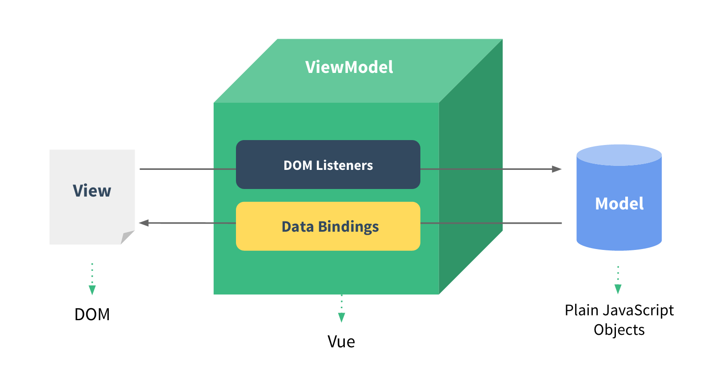
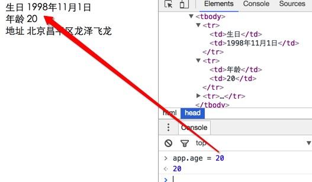

# 老马的Vue.js入门教程

此教程为Vue的基础入门教程，当然你必须要有一定的js、css、html的基础，最好有ES6的基础，没有ES6基础的童鞋可以参考[阮一峰老师的ES6教程](http://es6.ruanyifeng.com/)，最好有一点前端工作流的概念，对Webpack有所了解。 本教程大部分参考[Vue官网](https://cn.vuejs.org/)的文档，当然也有很多坑会详细介绍，也作为我自己学习Vue过程中的一些心得记录。如有错误之处请多多指教。

# Vue入门之概念及Helloworld

## Vue简介
`Vue`是一个前端的双向绑定类的框架，发音[读音 /vjuː/, 类似于 view]。新的Vue版本参考了React的部分设计，当然也有自己独特的地方，比如Vue的单文件组件开发方式都很有创新，另外Vue自身的一些绑定的语法、用法等都非常精炼，很容易上手，而且第三方的插件都非常丰富，社区非常活跃，最新的文档都有中文版本。而且Vue配合官方的和第三方的库可以实现单文件的组件化开发、SPA等现代化前端开发。  
详情请参考[Vue官网](https://cn.vuejs.org/)

## Vue的入门demo

`Vue` 可以直接把它当做一个js库使用，所以它可以很容易的接入到你的项目或者单个页面中。甚至你可以只使用它的双向绑定功能。所以它很容易上手。

比如：我们有一个需求，一个网页上一个Div标签，我们有一个json对象存储数据，把json对象上的数据放到Div上去。   

接下来是步骤：
```
第一步： 创建一个文件夹并创建一个html文件 比如：index.html.
当如你可以选择你自己的编辑器，我就用VSCode。

第二步：引入Vue库
<script src="https://unpkg.com/vue/dist/vue.js"></script>
当然了你可以直接下载Vue的js文件，推荐你直接用上面的cdn即可。

第三步：创建一个Div，给它一个id，比如：app

第四步：创建Vue的对象，并把数据绑定到上面创建好的div上去。
```
最终的代码如下：
```html
<!DOCTYPE html> <!--第一步：创建文件夹及html文件-->
<html lang="en">
<head>
  <meta charset="UTF-8">
  <title>Vue入门之Helloworld</title>
  <!--第二步：引入Vue库-->
  <script src="https://unpkg.com/vue/dist/vue.js"></script>
</head>
<body>
  <!--第三步:创建一个Div-->
  <div id="app">
    <!--Vue的模板的绑定数据的方法， 类似于很多其他前端的模板，可以用两对花括号进行绑定Vue中的数据对象的属性 -->
    {{ message }}
  </div>

  <!--第四步：创建Vue的对象，并把数据绑定到上面创建好的div上去。-->
  <script>
    var app = new Vue({         // 创建Vue对象。Vue的核心对象。
      el: '#app',               // el属性：把当前Vue对象挂载到 div标签上，#app是id选择器
      data: {                   // data: 是Vue对象中绑定的数据
        message: 'Hello Vue!'   // message 自定义的数据
      }
    });
  </script>
</body>
</html>

```
最终的结果就是：
```
Hello Vue!
```

----

## Vue的Helloworld总结
- Vue的el属性，就是element缩写，当前Vue对象挂载到哪个标签上的语法，一般用id选择器选择当前页面的标签。
- Vue的data属性是自定义数据。这里我们只是演示了一个message属性，其实可以跟Ajax配合从后台获取数据，那就可以....想象空间很丰富了吧..
- Vue 数据绑定的方式就是用 `{{}}`，类似于handlebars.
- 上面这个demo就是演示了Vue的绑定数据的基本模型。注意点，标签先创建好了之后，再创建Vue对象，具体你应该懂吧。


# Vue入门之数据绑定

## 什么是双向绑定？
Vue框架很核心的功能就是双向的数据绑定。
双向是指：HTML标签数据 绑定到 Vue对象，另外反方向数据也是绑定的。通俗点说就是，Vue对象的改变会直接影响到HTML的标签的变化，而且标签的变化也会反过来影响Vue对象的属性的变化。   
这样以来，就彻底变革了之前Dom的开发方式，之前Dom驱动的开发方式尤其是以jQuery为主的开发时代，都是dom变化后，触发js事件，然后在事件中通过js代码取得标签的变化，再跟后台进行交互，然后根据后台返回的结果再更新HTML标签，异常的繁琐。有了Vue这种双向绑定，让开发人员只需要关心json数据的变化即可，Vue自动映射到HTML上，而且HTML的变化也会映射回js对象上，开发方式直接变革成了前端由数据驱动的
开发时代，远远抛弃了Dom开发主导的时代了。



## Vue绑定文本

数据绑定最常见的形式就是使用 “Mustache” 语法（双大括号）的文本插值，比如模板引擎：handlebars中就是用的`{{}}`.   
创建的Vue对象中的data属性就是用来绑定数据到HTML的。参考如下代码：
```html
<span>Message: {{ msg }}</span>
<script>
  var app = new Vue({         // 创建Vue对象。Vue的核心对象。
    el: '#app',               // el属性：把当前Vue对象挂载到 div标签上，#app是id选择器
    data: {                   // data: 是Vue对象中绑定的数据
      msg: 'Hello Vue!'   // message 自定义的数据
    }
  });
</script>
```

## 绑定数据中使用JavaScript表达式
对于所有的数据绑定， Vue.js 都提供了完全的 JavaScript 表达式支持。

```html
<span>Message: {{ msg + ' - ' + name }}</span>
<script>
  var app = new Vue({         // 创建Vue对象。Vue的核心对象。
    el: '#app',               // el属性：把当前Vue对象挂载到 div标签上，#app是id选择器
    data: {                   // data: 是Vue对象中绑定的数据
      msg: 'Hi',              // message 自定义的数据
      name: 'flydragon'       // name自定义的属性，vue可以多个自定义属性，属性类型也可是复杂类型
    }
  });
</script>
```
结果：
```
Hi - flydragon
```

当然Vue还可以支持表达中的任何计算、函数处理等。参考下面的综合点的案例。

```html
<!DOCTYPE html> 
<html lang="en">
<head>
  <meta charset="UTF-8">
  <title>Vue入门之数据绑定-表达式运算</title>
  <script src="https://unpkg.com/vue/dist/vue.js"></script>
</head>
<body>
  <div id="app">
    {{ msg + ' - ' + name }}
    <p>
      {{ isOk ? '123' : '456' }}
    </p>
    <p>我的年龄是： {{ age *2 }}</p>
  </div>

  <script>
  var app = new Vue({         // 创建Vue对象。Vue的核心对象。
    el: '#app',               // el属性：把当前Vue对象挂载到 div标签上，#app是id选择器
    data: {                   // data: 是Vue对象中绑定的数据
      msg: 'Hi',              // message 自定义的数据
      name: 'flydragon',
      isOk: true,
      age: 18
    }
  });
  </script>
</body>
</html>
```

## Vue属性绑定
Vue中不能直接使用`{{ expression }}` 语法进行绑定html的标签，而是用它特有的v-bind指令（就是一种写法，先按照格式走，具体指令是什么可以后续再了解）。   

绑定的语法结构：
```
<标签 v-bind:属性名="要绑定的Vue对象的data里的属性名"></标签>
例如:
<span v-bind:id="menuId">{{ menuName }}</span>
```
参考如下代码案例：
```html
<!DOCTYPE html> 
<html lang="en">
<head>
  <meta charset="UTF-8">
  <title>Vue入门之数据绑定--属性绑定</title>
  <script src="https://unpkg.com/vue/dist/vue.js"></script>
</head>
<body>
  <div id="app">
    <div v-bind:id="MenuContaineId">
      <a href="#" v-bind:class="MenuClass">首页</a>
      <a href="#" v-bind:class="MenuClass">产品</a>
      <a href="#" v-bind:class="MenuClass">服务</a>
      <a href="#" v-bind:class="MenuClass">关于</a>
    </div>
  </div>

  <script>
    var app = new Vue({         
      el: '#app',               
      data: {                   // data: 是Vue对象中绑定的数据
        MenuClass: 'top-menu',
        MenuContaineId: 'sitemenu'
      }
    });
  </script>
</body>
</html>
```

## 属性绑定简写
由于`v-bind` 使用非常频繁，所以Vue提供了简单的写法，可以去掉v-bind直接使用`:`即可。
```html
例如：
<div :id="MenuContaineId">
等价于
<div v-bind:id="MenuContaineId">
```

## 输出纯HTML
由于Vue对于输出绑定的内容做了提前encode，保障在绑定到页面上显示的时候不至于被xss攻击。但某些场景下，我们确保后台数据是安全的，那么我们就要在网页中显示原生的HTML标签。Vue提供了`v-html`指令。
```html
<div id="app">
  <div v-bind:id="MenuContaineId" v-html="MenuBody">
  </div>
</div>
<script>
  var app = new Vue({         
    el: '#app',               
    data: {                   // data: 是Vue对象中绑定的数据
      MenuContaineId: 'menu',
      MenuBody: '<p>这里是菜单的内容</p>'
    }
  });
</script>
```
结果：
```html
<div id="app">
  <div id="menu">
    <p>这里是菜单的内容</p>
  </div>
</div>
```

## 样式绑定
对于普通的属性的绑定，只能用上面的讲的绑定属性的方式。而Vue专门加强了class和style的属性的绑定。可以有复杂的对象绑定、数组绑定样式和类。

### 绑定样式对象
经常我们需要对样式进行切换，比如：div的显示和隐藏，某些标签active等。Vue提供的对象绑定样式的方式就很容做这些事情。
```html
代码：
<div v-bind:class="{ active: isActive }"></div>
解释：
当 isActive为 true时， div就会具有了active样式类，如果 isActive为false，那么div就去掉active样式类。
```

```html
<!DOCTYPE html> 
<html lang="en">
<head>
  <meta charset="UTF-8">
  <title>Vue入门之绑定样式类</title>
  <script src="https://unpkg.com/vue/dist/vue.js"></script>
  <style>
  .active {
    background-color: #ccc;
  }
  </style>
</head>
<body>
  <div id="app">
    <div v-bind:id="MenuContaineId" v-bind:class="{ active: isActive }">
      绑定颜色类
    </div>
  </div>
  <script>
    var app = new Vue({         
      el: '#app',               
      data: {                   // data: 是Vue对象中绑定的数据
        MenuContaineId: 'menu',
        isActive: true
      }
    });
  </script>
</body>
</html>
```

### 混合普通的HTML标签样式类及绑定样式对象

v-bind:class 指令可以与普通的 class 属性共存。
```html
<div id="app">
  <div class="static"
     v-bind:class="{ active: isActive, 'text-danger': hasError }">
  </div>
</div>
<script>
  var app = new Vue({         
    el: '#app',               
    data: {                   // data: 是Vue对象中绑定的数据
      isActive: true,
      hasError: false
    }
  });
</script>
```
结果：
```html
<div id="app">
  <div class="static active">
  </div>  
</div>
```

### 绑定data中的样式对象
直接在html属性中的双引号内写对象，还是很不爽，也没有智能提示，很容易写错。
Vue可以让我们直接把绑定的class字符串指向data的一个对象，这样就非常方便了，既可以有智能提示，又可以很复杂进行编辑，不用担心烦人的`""`了。

```html
<div id="app">
  <div class="static"
     v-bind:class="classObject">
  </div>
</div>
<script>
  var app = new Vue({         
    el: '#app',               
    data: {
      classObject: {
        active: true,
        'text-danger': false
      }
    }
  });
</script>
```
结果：
```html
<div id="app">
  <div class="static active">
  </div>
</div>

```

### 绑定样式数组
其实绑定数组，就是绑定样式对象的延续，看官网的例子代码吧。
```html
<div v-bind:class="[activeClass, errorClass]">

data: {
  activeClass: 'active',
  errorClass: 'text-danger'
}
```

当然还有很多其他很有趣的支持，就不赘述了。
```html
例如:
<div v-bind:class="[isActive ? activeClass : '', errorClass]">
<div v-bind:class="[{ active: isActive }, errorClass]">
```

### 内联样式绑定
内联样式的绑定，非常类似于样式类的操作。v-bind:style 的对象语法十分直观——看着非常像 CSS ，其实它是一个 JavaScript 对象。 CSS属性名可以用驼峰式（camelCase）或短横分隔命名（kebab-case）。

看个例子：
```html
<!DOCTYPE html> 
<html lang="en">
<head>
  <meta charset="UTF-8">
  <title>Vue入门之htmlraw</title>
  <script src="https://unpkg.com/vue/dist/vue.js"></script>
</head>
<body>
  <div id="app">
    <div v-bind:style="{fontSize: size + 'px', backgroundColor: bgcolor, width: width}">
      vue 入门系列教程
    </div>
  </div>
  <script>
    var app = new Vue({         
      el: '#app',               
      data: {                   
        size: 19,
        width: 200,
        bgcolor: 'red'
      }
    });
  </script>
</body>
</html>

```

自动添加前缀   
当 v-bind:style 使用需要特定前缀的 CSS 属性时，如 transform ，Vue.js 会自动侦测并添加相应的前缀。

## 计算属性
在做数据的绑定的时候,数据要进行处理之后才能展示到html页面上，虽然vue提供了非常好的表达式绑定的方法，但是只能应对低强度的需求。比如： 把一个日期按照规定格式进行输出，可能就需要我们对日期对象做一些格式化的出来，表达式可能就捉襟见肘了。

Vue对象提供的computed属性，可以让我们开发者在里面可以放置一些方法，协助我们绑定数据操作，这些方法可以跟data中的属性一样用，注意这些方法用的时候不要加`()`。
例子来了：
```html
<!DOCTYPE html> 
<html lang="en">
<head>
  <meta charset="UTF-8">
  <title>Vue入门之htmlraw</title>
  <script src="https://unpkg.com/vue/dist/vue.js"></script>
</head>
<body>
  <div id="app">
    <table>
      <tr>
        <!-- computed里面的函数可以直接当成data里面的属性用，非常方便，注意没有括号！！！-->
        <td>生日</td><td>{{ getBirthday }}</td>
      </tr>
      <tr>
        <td>年龄</td><td>{{ age }}</td>
      </tr>      
      <tr>
        <td>地址</td><td>{{ address }}</td>
      </tr>
    </table>
  </div>
  <script>
    var app = new Vue({         
      el: '#app',               
      data: {                   
        birthday: 914228510514,     // 这是一个日期对象的值：1998年11月1日
        age: 19,
        address: '北京昌平区龙泽飞龙'
      },
      computed: {
        // 把日期换成 常见规格格式的字符串。
        getBirthday: function () {
          var m = new Date(this.birthday);
          return m.getFullYear() + '年' + m.getMonth() +'月'+ m.getDay()+'日';
        }
      }
    });
  </script>
</body>
</html>
```

## 绑定的数据过滤器
过滤器本质就是数据在呈现之前先进行过滤和筛选。官网上写的不错，我就不再赘述，下面是官网的描述。

Vue.js 允许你自定义过滤器，被用作一些常见的文本格式化。过滤器应该被添加在 mustache 插值的尾部，由“管道符”指示：
```
{{ message | capitalize }}
<!-- in mustaches -->
{{ message | capitalize }}
<!-- in v-bind -->
<div v-bind:id="rawId | formatId"></div>
Vue 2.x 中，过滤器只能在 mustache 绑定和 v-bind 表达式（从 2.1.0 开始支持）中使用，因为过滤器设计目的就是用于文本转换。为了在其他指令中实现更复杂的数据变换，你应该使用计算属性。

过滤器函数总接受表达式的值作为第一个参数。
new Vue({
  // ...
  filters: {
    capitalize: function (value) {
      if (!value) return ''
      value = value.toString()
      return value.charAt(0).toUpperCase() + value.slice(1)
    }
  }
})
过滤器可以串联：
{{ message | filterA | filterB }}
过滤器是 JavaScript 函数，因此可以接受参数：
{{ message | filterA('arg1', arg2) }}
这里，字符串 'arg1' 将传给过滤器作为第二个参数， arg2 表达式的值将被求值然后传给过滤器作为第三个参数。
```

## 核心：自动响应对象的变化到HTML标签
上面的例子都是 数据对象是写死在创建的Vue对像上，那如果数据（data）发生改变时会怎样呢？
让我们用chrome把上面例子的页面打开，并打开发者工具控制台,输入：`app.age = 20` 会有什么情况发生呢？

---


在页面中添加一个按钮，动态的增加年龄：

```html
<!DOCTYPE html> 
<html lang="en">
<head>
  <meta charset="UTF-8">
  <title>Vue入门之htmlraw</title>
  <script src="https://unpkg.com/vue/dist/vue.js"></script>
</head>
<body>
  <div id="app">
    <table>
      <tr>
        <!-- computed里面的函数可以直接当成data里面的属性用，非常方便，注意没有括号！！！-->
        <td>生日</td><td>{{ getBirthday }}</td>
      </tr>
      <tr>
        <td>年龄</td><td>{{ age }}</td>
      </tr>      
      <tr>
        <td>地址</td><td>{{ address }}</td>
      </tr>
    </table>
  </div>

  <!-- 添加下面这行代码，动态增加 年龄，页面会有怎样的变化呢？？ -->
  <button type="button" onclick="app.age+=1;" >加加</button>
  <script>
    var app = new Vue({         
      el: '#app',               
      data: {                   
        birthday: 914228510514,     // 这是一个日期对象的值：1998年11月1日
        age: 19,
        address: '北京昌平区龙泽飞龙'
      },
      computed: {
        // 把日期换成 常见规格格式的字符串。
        getBirthday: function () {
          var m = new Date(this.birthday);
          return m.getFullYear() + '年' + m.getMonth() +'月'+ m.getDay()+'日';
        }
      }
    });
  </script>
</body>
</html>

```

## 双向数据绑定

上面的例子我们大多讲的是单向的 js对象向 HTML数据进行绑定，那HTML怎样向js进行反馈数据呢？
HTML中只有表达能接受用户的输入，最简单的演示双向绑定的就是文本框了。

Vue提供了一个新的指令：v-model进行双向数据的绑定，注意不是v-bind。
```html
<!DOCTYPE html> 
<html lang="en">
<head>
  <meta charset="UTF-8">
  <title>Vue入门之htmlraw</title>
  <script src="https://unpkg.com/vue/dist/vue.js"></script>
</head>
<body>
  <div id="app">
    <!-- v-model可以直接指向data中的属性，双向绑定就建立了 -->
    <input type="text" name="txt" v-model="msg">
    <p>您输入的信息是：{{ msg }}</p>
  </div>
  <script>
    var app = new Vue({         
      el: '#app',               
      data: {                   
        msg: '双向数据绑定的例子'
      }
    });
  </script>
</body>
</html>
```

最终的结果就是：你改变input文本框的内容的时候，p标签中的内容会跟着进行改变，哇是不是很神奇呢...

关于其他表单的绑定的语法我就不赘述了，还是参考官网吧，我这里大部分例子也是来自[官网](https://cn.vuejs.org/v2/guide/forms.html#基础用法)。

## 数据绑定总结

vue提供了大量的绑定的语法和方法，非常方便我们进行数据的绑定，尤其它是双向的数据绑定，极大的减少了我们dom操作的麻烦程度。可能你越来越喜欢它了吧...

# Vue列表渲染及条件渲染实战

## 条件渲染

有时候我们要根据数据的情况，决定标签是否进行显示或者有其他动作。最常见的就是，表格渲染的时候，如果表格没有数据，就显示无数据。如果有数据就显示表格数据。
Vue帮我们提供了一个`v-if`的指令，帮助我们完成判断的模板处理。

```html
<div id="app">
  <h1 v-if="ok">Yes</h1>
  <h1 v-else>No</h1>  
</div>
<!-- 当ok为true的时候，输出： Yes， 否则输出： No -->

<script>
  var app = new Vue({         
    el: '#app',               
    data: {    
      ok: true      // true,返回：Yes，   false=> No               
    }
  });
</script>
```

`v-if`指令可以根据数据绑定的情况进行插入标签或者移除标签。
当然，如果熟悉js的都清楚，有if，肯定会有else。 Vue提供的是 `v-else`指令。

## 列表渲染

### 基本v-for循环渲染标签
模板引擎都会提供循环的支持。Vue也不例外，Vue是提供了一个`v-for`指令。基本的用法类似于foreach的用法。还是看例子最直接，上代码：

```html
<div id="app">
  <table>
    <thead>
      <tr>
        <th>姓名</th>
        <th>年龄</th>
        <th>地址</th>
      </tr>
    </thead>
    <tbody> 
      <!-- 每次for循环，都会创建一个tr标签。item是遍历的元素。 -->
      <tr v-for="item in UserList" >
        <td>{{ item.name }}</td>
        <td>{{ item.age }}</td>
        <td>{{ item.address }}</td>
      </tr>
    </tbody>
  </table>
</div>
<script>
  var app = new Vue({         
    el: '#app',               
    data: {                   
     UserList: [
      {'name': 'malun', 'age': 18, 'address': '北京黑地下室'},
      {'name': 'flydragon', 'age': 22, 'address': '厦门的很多热的地方'},
      {'name': 'temp', 'age': 25, 'address': '东北松花江上'}
     ]
    }
  });
</script>
```

### Template循环渲染多标签
上面的例子，我们演示的是 每次循环输出一个tr标签。如果我们希望每次循环生成两个tr标签呢？如果还有生成其他的标签呢？

Vue给我们提供了template标签，供我们用于v-for循环中进行处理。

上代码喽：
```html
<ul>
  <!-- 通过template标签，可以一次循环，输出两个li标签 -->
  <template v-for="item in items">
    <li>{{ item.msg }}</li>
    <li class="divider"></li>
  </template>
</ul>
```

### 关于v-for对应的数组的更新
由于Vue的机制就是检测数据的变化，自动跟新HTML。数组的变化，Vue之检测部分函数，检测的函数执行时才会触发视图更新。这些方法如下：
- push()
- pop()
- shift()
- unshift()
- splice()
- sort()
- reverse()

## 表格显示的综合案例
下面是一个综合的案例，每秒钟往表格中添加一条数据。
本案例综合使用了v-if 和 v-for循环综合案例。
```html
<!DOCTYPE html> 
<html lang="en">
<head>
  <meta charset="UTF-8">
  <title>Vue入门之动态显示表格</title>
  <script src="https://unpkg.com/vue/dist/vue.js"></script>
</head>
<body>
  <div id="app">
    <table>
      <thead>
        <tr>
          <th>姓名</th>
          <th>年龄</th>
          <th>地址</th>
        </tr>
      </thead>
      <!-- 如果列表有数据，直接输出表格数据，没有数据提示用户没有数据 -->
      <tbody v-if="UserList.length > 0"> 
        <tr v-for="item in UserList" >
          <td>{{ item.name }}</td>
          <td>{{ item.age }}</td>
          <td>{{ item.address }}</td>
        </tr>
      </tbody>
      <tbody v-else>
        <tr><td colspan="3">没有数据奥！</td></tr>
      </tbody>
    </table>
  </div>
  <script>
    var app = new Vue({         
      el: '#app',               
      data: {                   
       UserList: []
      }
    });

    // 每秒钟插入一条数据。
    setInterval(function () {
      app.UserList.push({'name': 'malun', 'age': 18, 'address': '北京黑地下室'});
    }, 1000);
  </script>
</body>
</html>
```

## 总结列表和条件绑定
列表的使用其实本质还是js的衍生使用，对于有js开发基础的没有什么难度。关键是多写几个案例就会详细通了。

# Vue事件处理

## 监听事件的Vue处理
Vue提供了协助我们为标签绑定时间的方法，当然我们可以直接用dom原生的方式去绑定事件。Vue提供的指令进行绑定也是非常方便，而且能让ViewModel更简洁，逻辑更彻底。所以还是推荐大家使用的。

Vue提供了`v-on`指令帮助我们进行事件的绑定。
基本的内联事件处理方法[官方demo]：   

```html
<div id="example-1">
  <!-- 为按钮绑定点击事件，执行counter += 1的任务。 -->
  <button v-on:click="counter += 1">增加 1</button>
  <p>这个按钮被点击了 {{ counter }} 次。</p>
</div>
<script>
var example1 = new Vue({
  el: '#example-1',
  data: {
    counter: 0
  }
})
</script>
```

## 事件处理方法集成到Vue对象
内联的方式绑定的事件，只能处理简单的事件的处理逻辑。复杂的情况还是封装到js中最方便，也不容易出错。
Vue对象中可以添加methods属性，开发者可以把事件处理函数的逻辑放到methods中。

```html
<!DOCTYPE html> 
<html lang="en">
<head>
  <meta charset="UTF-8">
  <title>Vue入门之动态显示表格</title>
  <script src="https://unpkg.com/vue/dist/vue.js"></script>
</head>
<body>
  <div id="app">
    <p>{{ number }}</p>
    <input type="button" name="btnGetNumber" value="增加[绑定事件处理器]" v-on:click="getNumber">
    <input type="button" name="btnGetNumber" value="增加[内联方法调用]" v-on:click="getNumber()">
  </div>
  <script>
    var app = new Vue({         
      el: '#app',               
      data: {                   
        number: 1
      },
      methods: {
        // 事件响应方法的逻辑代码
        getNumber: function (e) {
          this.number += 1;   // 不管是内联方法调用，还是绑定事件处理器两种方式执行事件响应方法的时候 this都是指向 app
        }
      }
    });
  </script>
</body>
</html>
```

## 事件修饰符
官网上写的非常好，这块就直接用管网的吧。在事件处理程序中调用 event.preventDefault() 或 event.stopPropagation() 是非常常见的需求。尽管我们可以在 methods 中轻松实现这点，但更好的方式是：methods 只有纯粹的数据逻辑，而不是去处理 DOM 事件细节。
为了解决这个问题， Vue.js 为 v-on 提供了 事件修饰符。通过由点(.)表示的指令后缀来调用修饰符。
- .stop
- .prevent
- .capture
- .self
- .once
```html
<!-- 阻止单击事件冒泡 -->
<a v-on:click.stop="doThis"></a>
<!-- 提交事件不再重载页面 -->
<form v-on:submit.prevent="onSubmit"></form>
<!-- 修饰符可以串联  -->
<a v-on:click.stop.prevent="doThat"></a>
<!-- 只有修饰符 -->
<form v-on:submit.prevent></form>
<!-- 添加事件侦听器时使用事件捕获模式 -->
<div v-on:click.capture="doThis">...</div>
<!-- 只当事件在该元素本身（而不是子元素）触发时触发回调 -->
<div v-on:click.self="doThat">...</div>
<!-- the click event will be triggered at most once -->
<a v-on:click.once="doThis"></a>
```

## 按键修饰符
在监听键盘事件时，我们经常需要监测常见的键值。 Vue 允许为 v-on 在监听键盘事件时添加按键修饰符：
```html
<!-- 只有在 keyCode 是 13 时调用 vm.submit() -->
<input v-on:keyup.13="submit">
记住所有的 keyCode 比较困难，所以 Vue 为最常用的按键提供了别名：
<!-- 同上 -->
<input v-on:keyup.enter="submit">
<!-- 缩写语法 -->
<input @keyup.enter="submit">
```

全部的按键别名：

- .enter
- .tab
- .delete (捕获 “删除” 和 “退格” 键)
- .esc
- .space
- .up
- .down
- .left
- .right
- .ctrl
- .alt
- .shift
- .meta

## 事件绑定的简写
Vue中属性的绑定的简写直接是`:` === 'v-bind:'   
而事件的缩写是直接变成`@`.  也就是说：  `v-on:` === `@`
看下面的例子：
```html
<!-- 完整语法 -->
<a v-on:click="doSomething"></a>
<!-- 缩写 -->
<a @click="doSomething"></a>
```

## 事件绑定总结

Vue为了方便大家进行开发，提供了事件的相关的封装，可以让我们方便我们用Vue对事件进行开发，尤其是v-on指令的非常方便的跟Vue对象中methods进行配合进行复杂的事件处理，非常方便。另外事件的事件修饰符和按键修饰符也可以让Vue事件这块锦上添花。


